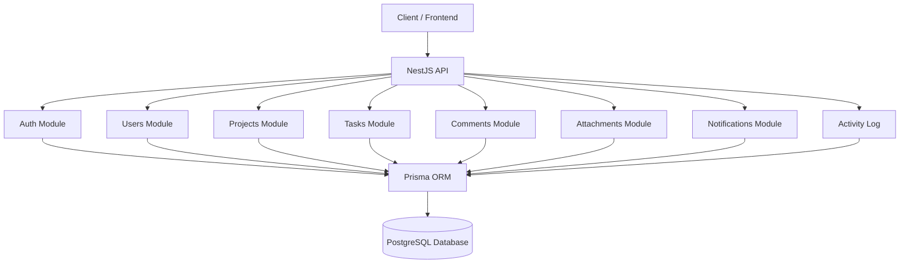
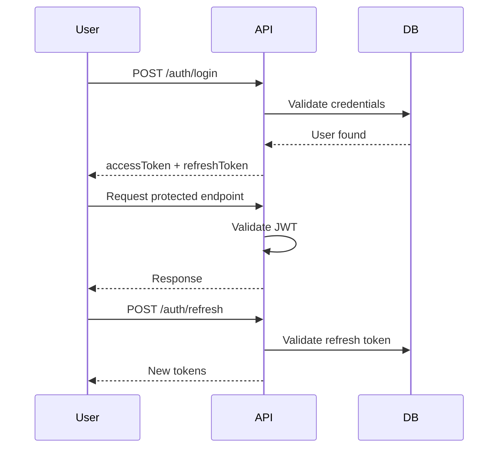

# TaskFlow API

Backend API for a **project and task management system** inspired by
tools like **Linear / Jira / ClickUp**.

This project demonstrates a **production-ready backend architecture**
using **NestJS**, **Prisma**, and **PostgreSQL**, including
authentication, permissions, activity logs, real-time notifications,
testing, and Docker deployment.

------------------------------------------------------------------------

# Features

## Authentication & Security

-   JWT authentication
-   Refresh token rotation
-   Secure logout
-   Rate limiting
-   Role-based access control

## Project Management

-   Create, update, delete projects
-   Project membership system
-   Roles: OWNER, MEMBER, VIEWER
-   Permissions enforcement

## Tasks

-   Create, update, delete tasks
-   Assign tasks to users
-   Status and priority system
-   Advanced filters (search, sorting, due date range, assignedTo,
    createdBy)

## Comments

-   Comment on tasks
-   Edit/delete by author
-   Activity tracking

## Attachments

-   Upload files to tasks
-   List attachments
-   Delete attachments

## Notifications

-   Task assignment notifications
-   Comment notifications
-   WebSocket realtime updates

## Activity Log

Tracks system activity including: - Project changes - Task changes -
Comment actions - Member changes

## Observability

-   Request ID middleware
-   Request logging
-   Health check endpoint

## Testing

End‑to‑end tests with Jest and Supertest covering: authentication,
permissions, projects, tasks, comments, notifications, attachments, and
activity logs.

## DevOps

-   Docker production build
-   Docker Compose environment
-   Prisma migrations
-   Seed script
-   GitHub Actions CI

------------------------------------------------------------------------

# Tech Stack

Backend: NestJS\
Database: PostgreSQL + Prisma ORM\
Authentication: JWT + Passport\
Validation: class-validator / class-transformer\
Realtime: Socket.IO\
Testing: Jest + Supertest\
Infrastructure: Docker / Docker Compose\
Documentation: Swagger (OpenAPI)

------------------------------------------------------------------------

# System Architecture

# Authentication Flow

------------------------------------------------------------------------

# Running with Docker

Start production environment:

    npm run docker:prod

API:

    http://localhost:3001

Swagger:

    http://localhost:3001/docs

Health check:

    http://localhost:3001/health
